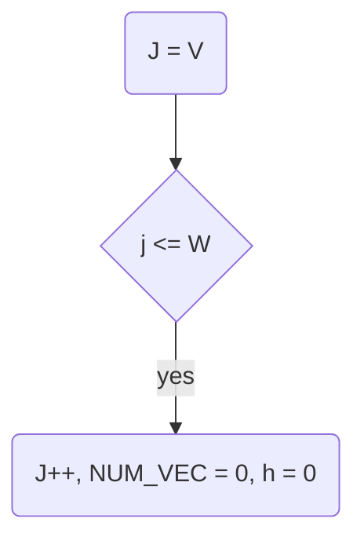

# VEC-TSS: a Tile Size Selection Method that Aligns Vectorizable Data for GEMM

## Algorithm 1
### Constant Variable Declaration
* V: the width of vector processing unit.
* H: the height of matrix
* W: the width of matrix
### Workflow
