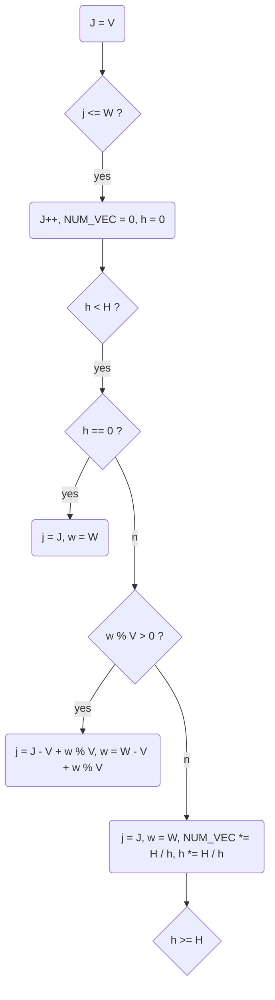

# VEC-TSS: a Tile Size Selection Tool that Aligns Vectorizable Data for GEMM

## Algorithm 1
### Constant Variable Declaration
* V: the width of vector processing unit.
* H: the height of matrix.
* W: the width of matrix.
### Nonconstant Variable Declaration
* res: the result, the best tile size.
* MAX_NUM_VEC: the maximal number of vectorizable data.
* NUM_VEC: the temporal number of vectorizable data.
* w: the efficient width of current row.
* j: the efficient size of current tile.
* n: 
### Workflow
